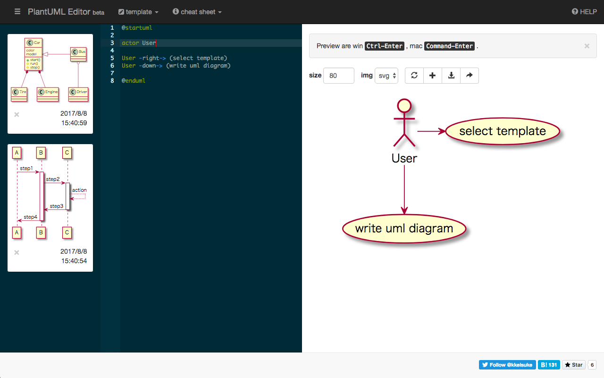

# PlantUML Editor

> A Vue.js, Vuex project

　PlantUML online demo client



## Features

- multiple PlantUML templates
- cheat sheet
- snippet
- zoom & scroll
- supports SVG & PNG
- save texts
- create gists
- support markdown
- download image
- print HTML

## Build Setup

``` bash

# Set path
export PATH=$PWD/node_modules/.bin:$PWD/node-v9.9.0-linux-x64/bin:$PATH

# install dependencies
npm install

# install flow-typed
npm install -g flow-typed
flow-typed install

# serve with hot reload at localhost:8080
npm run serve

# build for production with minification
npm run build

# run unit tests
npm run test

# run e2e tests
npm run e2e

# Run with ngrok
BASEURL="https:\/\/3f62d445.ngrok.io"
sed "s/{{localBaseUrl}}/${BASEURL}/g" atlassian-connect.json.tmpl > atlassian-connect.json
npm run dev
./ngrok http --host-header=rewrite 8080 

# Deploy to firebase
rm -fr dist/
BASEURL="https:\/\/powerplantuml.firebaseapp.com"
sed "s/{{localBaseUrl}}/${BASEURL}/g" atlassian-connect.json.tmpl > atlassian-connect.json
npm run build
firebase deploy
```

## Other

Pen graphic by [freepik](http://www.flaticon.com/authors/freepik) from [Flaticon](http://www.flaticon.com/) is licensed under [CC BY 3.0](http://creativecommons.org/licenses/by/3.0/). Check out the new logo that I created on [LogoMaker.com](http://logomakr.com) https://logomakr.com/7Gn1Ck
